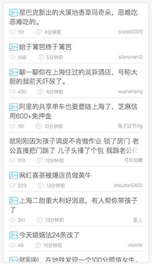
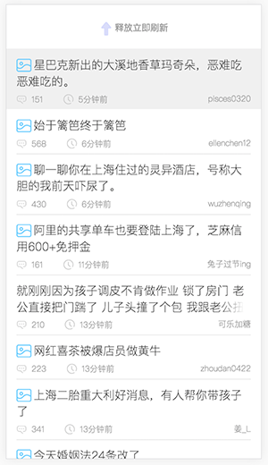

# loadScroll.js 
loadScroll是一个移动端的上拉、下拉加载更多的组件。基础库依赖jquery.js操作dom节点。

###效果图:

<br/> <br/>
###demo地址: <a href="https://github.com/William-Gu/loadScroll">https://github.com/William-Gu/loadScroll/blob/master/demo/demo.html</a>


###npm安装
```javascript
npm install loadScroll	//no now.
```
## 使用方法如下：

###1、html结构
```html
<ul id="loadScroll">
    <li>
        <div>构建需要的代码</div>
    </li>
    <li data-del="true"><!-- 如果这一行需要删除的话 -->
		<div class="loadScroll_cover">
			<button data-id="ad">remove</button>
		</div>
		<div class="loadScroll_front">我是传奇</div>
	</li>
    <li>
        <div>构建需要的代码</div>
    </li>
    <li>
        <div>构建需要的代码</div>
    </li>
</ul>
```
1234566


###2.1、需要引入的js
```javascript
<script src="../dist/loadScroll.js"></script>
```

###2.2、需要引入的css
```javascript
<script src="../dist/loadScroll.css"></script>
```

###3.1、创建参数
```javascript
// 创建loadScroll之前必须要先设置各参数
var params={};
params.topLoadingText=["下拉刷新","释放立即刷新","正在加载"],	//	[顶部原始提示,下拉提示,放开提示]
params.refreshList=function(){console.log("refreshList")},	//列表刷新函数
params.refreshListDone=function(data){console.log("refreshListDone")},
params.refreshListError=function(data){console.log("refreshListError")},
params.pushList={	//列表加载函数
	url:"/a",
	data:{},
	success:function(){console.log("pishListDone")},
	fail:function(){console.log("pishListFail")},
	error:function(){console.log("pishListError")}
},
params.removeItem={	//ajax删除某项的调用
	url:"/a",
	data:{},
	success:function(){console.log("removeItemDone")},
	fail:function(){console.log("removeItemFail")},
	error:function(){console.log("removeItemError")}
}

###3.2、调用loadScroll
loadScroll(params);

###4、API
####4.1 服务器json 返回值
```javascript
<li><div class="loadScroll_front">我是传奇</div></li>
```

###目录结构
loadScroll
```javascript
├────index.html         			// demo页面
├────dist
|      |──css
|      |   └──loadScroll.css        // css
|      └──js
|          └──loadScroll.js         // js
├────src
|      |──scss
|      |    └──loadScroll.scss     // 基础base样式
```
